# Inventory Service

A Django service for the Ansible Automation Platform (AAP), built on the
[ansible-services-framework](https://github.com/ansible/ansible-services-framework) (copier template)
and [django-ansible-base](https://github.com/ansible/django-ansible-base) (DAB).

Provides unified inventory management for AAP — discovering, cataloguing and
tracking infrastructure resources across VMware vSphere, public cloud and
bare-metal providers. Includes RBAC, activity streams, feature flags and
gateway authentication out of the box.

## Database Schema

The full entity-relationship diagram shows every model, field, and foreign-key
relationship in the inventory service PostgreSQL database:



> **Tip:** open the SVG directly in a browser to pan / zoom on the full diagram.

### VMware vSphere seed data example

The following diagram shows the topology created by the `seed_vmware_data`
management command — a realistic vSphere lab with 27 resources and 49
relationships. It illustrates how the schema above maps to real VMware objects
(vCenter, clusters, ESXi hosts, datastores, resource pools and VMs) and the
relationship types (`runs_on`, `attached_to`, `member_of`, `part_of`)
that connect them:


## Data Model

```
Provider
 └── CollectionRun              (one provider → many runs)
 └── Resource                   (one provider → many resources)
      ├── resource_type → ResourceType → ResourceCategory
      ├── ResourceRelationship  (source → target)
      │       types: runs_on, attached_to, member_of, part_of, manages
      └── ResourceSighting      (one resource → many sightings)
              point-in-time observation per collection run

ResourceType ← VendorTypeMapping (maps vendor-specific names → canonical types)
```

### Asset Identity and Tracking

Every resource carries a **canonical_id** — a stable cross-provider fingerprint
that persists across collection runs and even across different providers
observing the same physical or virtual asset. For compute resources this is
typically the SMBIOS UUID, which VMware, AWS EC2 and bare-metal IPMI all report.
Non-compute resources (datastores, clusters, pools) use the most stable
vendor-native identifier.

The **vendor_identifiers** JSONB field stores all vendor-specific IDs as
key-value pairs (e.g. `moid`, `bios_uuid`, `instance_uuid` for VMware;
`instance_id`, `smbios_uuid` for AWS EC2). This allows cross-referencing when
the same asset appears through multiple discovery paths.

Tracking fields on each resource:

| Field | Description |
|---|---|
| `canonical_id` | Stable fingerprint (SMBIOS UUID, vendor instance ID, MOID) |
| `vendor_identifiers` | All vendor-native IDs as JSONB key-value pairs |
| `first_discovered_at` | Timestamp of first collection run that found this resource |
| `last_seen_at` | Timestamp of most recent collection run that observed it |
| `seen_count` | Number of collection runs that have observed this resource |
| `description` | Description or notes for this resource |
| `boot_time` | Last boot/start time — used for uptime calculations |
| `cloud_tenant` | Cloud tenant/project/subscription (Azure, OpenStack, GCP) |
| `flavor` | Cloud instance type (e.g. `m5.xlarge`, `Standard_D4s_v3`) |
| `ems_created_on` | When the provider created this resource (not when we discovered it) |

Each collection run also creates a **ResourceSighting** — a lightweight
point-in-time snapshot capturing the resource state, compute metrics, and
optional type-specific metrics. Sightings enable historical graphing, drift
detection, and compliance auditing without bloating the Resource record.

The taxonomy (categories, types and vendor mappings) is seeded by migration and
covers 15 categories, 82 resource types and 20+ VMware vSphere mappings.

## Inventory API

Once deployed behind the AAP gateway the inventory endpoints are available at
`/api/inventory/v1/`. All endpoints require authentication.

### Providers — full CRUD

| Method | Endpoint | Description |
|---|---|---|
| `GET` | `/providers/` | List all providers (filterable, searchable) |
| `POST` | `/providers/` | Register a new infrastructure provider |
| `GET` | `/providers/{id}/` | Provider detail |
| `PATCH` | `/providers/{id}/` | Update provider fields |
| `PUT` | `/providers/{id}/` | Replace a provider |
| `DELETE` | `/providers/{id}/` | Remove a provider and its resources |
| `POST` | `/providers/{id}/collect/` | Trigger an inventory collection run |

**Filters:** `vendor`, `infrastructure`, `enabled`, `organization`
**Search:** `name`, `vendor`, `provider_type`
**Ordering:** `name`, `vendor`, `created`, `modified`

The `collect` action creates a `CollectionRun` in `pending` state and dispatches
an async task via dispatcherd. Returns `202 Accepted` with the run object, or
`409 Conflict` if the provider is disabled or a collection is already in progress.

```json
POST /api/inventory/v1/providers/{id}/collect/
{
    "collection_type": "full",
    "target_resource_types": ["virtual_machine", "vpc"]
}
```

### Collection Runs — read-only + cancel

| Method | Endpoint | Description |
|---|---|---|
| `GET` | `/collection-runs/` | List all collection runs (filterable) |
| `GET` | `/collection-runs/{id}/` | Run detail with status and timing |
| `POST` | `/collection-runs/{id}/cancel/` | Cancel a running or pending collection |

**Filters:** `status`, `provider`, `collection_type`
**Search:** `provider__name`, `task_uuid`
**Ordering:** `started_at`, `completed_at`, `status`

Collection runs are created exclusively through the provider `collect` action,
never directly via POST to this endpoint. The `cancel` action sends a cancel
command to the dispatcherd worker and marks the run as `canceled`.

### Resources — read-only

| Method | Endpoint | Description |
|---|---|---|
| `GET` | `/resources/` | List discovered resources (filterable, searchable) |
| `GET` | `/resources/{id}/` | Resource detail |

**Filters:** `provider`, `resource_type`, `state`, `region`, `os_type`, `organization`
**Search:** `name`, `ems_ref`, `canonical_id`, `fqdn`, `vendor_type`
**Ordering:** `name`, `state`, `first_discovered_at`, `last_seen_at`, `seen_count`

Resources are created by collection tasks, not directly via the API.

```
GET /api/inventory/v1/resources/?state=running
GET /api/inventory/v1/resources/?search=esxi
GET /api/inventory/v1/resources/?provider=<uuid>
GET /api/inventory/v1/resources/?os_type=linux
GET /api/inventory/v1/resources/?region=Lab-DC1
GET /api/inventory/v1/resources/?search=502e71fa   # search by SMBIOS UUID fragment
```

#### Nested resource endpoints — sightings and history

Each resource exposes two nested endpoints for historical tracking and
dashboard integration:

| Method | Endpoint | Description |
|---|---|---|
| `GET` | `/resources/{id}/sightings/` | Paginated sighting history for a single resource |
| `GET` | `/resources/{id}/history/` | Aggregated history summary for graphing and dashboards |

**Sightings** (`/resources/{id}/sightings/`) returns the full list of
point-in-time snapshots captured during collection runs, ordered newest first.
Use this to build historical graphs of state changes, compute metrics drift,
and compliance auditing for a single asset over time.

**Filters:** `seen_after`, `seen_before`, `state`

```
GET /api/inventory/v1/resources/{id}/sightings/
GET /api/inventory/v1/resources/{id}/sightings/?seen_after=2025-01-01T00:00:00Z
GET /api/inventory/v1/resources/{id}/sightings/?state=running
GET /api/inventory/v1/resources/{id}/sightings/?seen_after=2025-01-01&seen_before=2025-02-01
```

**History** (`/resources/{id}/history/`) returns an aggregated summary designed
for dashboard widgets and at-a-glance resource views. The response includes:

- **identity** — `canonical_id`, `vendor_identifiers`, `ems_ref`
- **tracking** — `first_discovered_at`, `last_seen_at`, `seen_count`
- **timeline** — ordered list of sighting snapshots (state, power_state, cpu, memory, disk, metrics)
- **summary** — aggregated stats: avg/min/max CPU, memory and disk across all sightings, distinct states observed, total sighting count

```
GET /api/inventory/v1/resources/{id}/history/
```

Example response (abbreviated):

```json
{
    "identity": {
        "canonical_id": "502e71fa-...",
        "vendor_identifiers": {"moid": "vm-101", "bios_uuid": "502e71fa-..."}
    },
    "tracking": {
        "first_discovered_at": "2025-01-15T08:30:00Z",
        "last_seen_at": "2025-02-14T14:22:00Z",
        "seen_count": 7
    },
    "summary": {
        "total_sightings": 7,
        "states_observed": ["running", "stopped"],
        "cpu": {"avg": 4.0, "min": 4, "max": 4},
        "memory_mb": {"avg": 16384.0, "min": 16384, "max": 16384}
    },
    "timeline": [
        {"seen_at": "2025-01-15T08:30:00Z", "state": "running", "cpu_count": 4, "memory_mb": 16384}
    ]
}
```

### Resource Relationships — read-only

| Method | Endpoint | Description |
|---|---|---|
| `GET` | `/resource-relationships/` | List all resource relationships |
| `GET` | `/resource-relationships/{id}/` | Relationship detail |

**Filters:** `relationship_type`, `source`, `target`
**Ordering:** `relationship_type`

### Resource Sightings — read-only historical data

| Method | Endpoint | Description |
|---|---|---|
| `GET` | `/resource-sightings/` | List sighting history (filterable) |
| `GET` | `/resource-sightings/{id}/` | Sighting detail |

**Filters:** `resource`, `collection_run`, `state`, `seen_after`, `seen_before`
**Search:** `resource__name`
**Ordering:** `seen_at`, `state`, `cpu_count`, `memory_mb`

Resource sightings are created automatically by collectors during collection
runs. Each sighting is a point-in-time snapshot of a resource state, enabling
historical graphing, drift detection and compliance auditing. Use the
`seen_after` / `seen_before` date-range filters to query a time window.

```
GET /api/inventory/v1/resource-sightings/?resource=<uuid>
GET /api/inventory/v1/resource-sightings/?resource=<uuid>&seen_after=2025-01-01T00:00:00Z
GET /api/inventory/v1/resource-sightings/?state=running
```

### Taxonomy — read-only reference data

The taxonomy endpoints expose the normalized resource classification hierarchy:
`ResourceCategory` → `ResourceType` → `VendorTypeMapping`.

| Method | Endpoint | Description |
|---|---|---|
| `GET` | `/resource-categories/` | Top-level resource categories |
| `GET` | `/resource-categories/{id}/` | Category detail |
| `GET` | `/resource-types/` | Resource types within each category |
| `GET` | `/resource-types/{id}/` | Type detail |
| `GET` | `/vendor-type-mappings/` | Maps vendor-specific types to canonical types |
| `GET` | `/vendor-type-mappings/{id}/` | Mapping detail |

**Resource Categories** — Search: `name`, `slug` · Ordering: `sort_order`, `name`
**Resource Types** — Filters: `category`, `is_countable` · Search: `name`, `slug` · Ordering: `sort_order`, `name`, `category`
**Vendor Type Mappings** — Filters: `vendor`, `resource_type` · Search: `vendor`, `vendor_resource_type` · Ordering: `vendor`, `vendor_resource_type`

```
GET /api/inventory/v1/resource-types/?search=virtual_machine
GET /api/inventory/v1/vendor-type-mappings/?vendor=vmware
```

### Property Definitions — schema contract for Resource.properties

The `PropertyDefinition` model solves the consistency problem with JSONB
`properties` by defining the expected keys, types, and descriptions for each
`ResourceType`. Collector authors query this endpoint to discover what keys to
write, ensuring consistent naming across all collectors (no more
`publicly_available` vs `public` vs `is_public`).

| Method | Endpoint | Description |
|---|---|---|
| `GET` | `/property-definitions/` | List all property definitions (filterable) |
| `GET` | `/property-definitions/{id}/` | Definition detail |

**Filters:** `resource_type`, `vendor_scope`, `required`, `value_type`
**Search:** `key`, `name`
**Ordering:** `key`, `name`, `resource_type`

```
GET /api/inventory/v1/property-definitions/?resource_type=<uuid>
GET /api/inventory/v1/property-definitions/?resource_type=<uuid>&vendor_scope=vmware
GET /api/inventory/v1/property-definitions/?required=true
```

Each definition includes:
- **key** — the exact JSONB key collectors should use
- **value_type** — expected type (string, integer, float, boolean, datetime, json)
- **required** — whether collectors MUST populate this
- **vendor_scope** — if set, only applies to a specific vendor
- **example_value** — documentation example

### Provider Plugins — read-only registry API

The provider plugin endpoints expose the runtime plugin registry from the
external `inventory_providers` package. These are **not** model-backed — the data comes from the in-memory registry that
discovers plugins at startup from built-in packages, Python entry points,
and runtime registrations.

| Method | Endpoint | Description |
|---|---|---|
| `GET` | `/provider-plugins/` | List all discovered plugins with manifest summaries |
| `GET` | `/provider-plugins/{vendor:type}/` | Plugin detail with dependency file contents |
| `POST` | `/provider-plugins/{vendor:type}/test/` | Test connectivity for configured instances |
| `POST` | `/provider-plugins/refresh/` | Force re-discovery without service restart |

The list endpoint returns each discovered plugin with its manifest metadata,
supported resource types, and the number of Provider model instances currently
configured to use it. The detail endpoint additionally includes the raw
contents of dependency files (requirements.txt, requirements.yml, bindep.txt).

```
GET /api/inventory/v1/provider-plugins/
GET /api/inventory/v1/provider-plugins/vmware:vcenter/
GET /api/inventory/v1/provider-plugins/vmware:vcenter/test/
POST /api/inventory/v1/provider-plugins/refresh/
```

The `test` action instantiates the plugin for each enabled Provider instance
and calls `validate_connection()`, returning a per-instance pass/fail result.
The `refresh` action resets and re-scans the registry — useful after pip
installing a new external provider package without restarting the service.

#### Pluggable provider architecture

Provider plugins are discovered from three sources (in order of precedence):

1. **Built-in** — Python packages in `apps/inventory/providers/` that subclass
   `BaseProvider`. Discovered automatically at startup.
2. **Entry-point** — External packages declaring the
   `inventory_service.providers` entry point group in pyproject.toml.
3. **Runtime** — Programmatic registration via `registry.register()`.

Each provider package may include Ansible collection-compatible dependency
files (requirements.txt, requirements.yml, bindep.txt,
meta/execution-environment.yml). The registry introspects these for the
`/dependencies/` endpoint and for execution environment builds.

### Platform endpoints (via django-ansible-base)

These endpoints are provided by the framework and cover org/user/team
management, RBAC, activity streams and service discovery.

| Method | Endpoint | Description |
|---|---|---|
| `GET/POST` | `/organizations/` | Organization management |
| `GET/PATCH` | `/organizations/{id}/` | Organization detail |
| `GET` | `/organizations/{id}/teams/` | Teams in an organization |
| `GET/POST` | `/teams/` | Team management |
| `GET/PATCH` | `/teams/{id}/` | Team detail |
| `GET` | `/users/` | User listing |
| `GET` | `/users/{id}/` | User detail |
| `GET` | `/role_definitions/` | RBAC role definitions |
| `GET` | `/activitystream/` | Activity stream |
| `GET` | `/feature_flags/` | Feature flag management |
| `GET` | `/service-index/` | Service index |
| `GET` | `/docs/` | API documentation (browsable) |

### Health and operational endpoints

| Method | Endpoint | Description |
|---|---|---|
| `GET` | `/ping/` | Lightweight liveness check |
| `GET` | `/health/` | Service health status |

## Quick Start — Collection Workflow

End-to-end example: upload a provider plugin, create a provider, run a
collection and inspect the results. All commands assume the service is
accessible at `http://localhost:44926` and the admin password is in `$PASS`.

### 1. Upload a provider plugin

Provider plugins live in the
[is-providers](https://github.com/jonnyfiveiq/is-providers) repository.
Each plugin has an `install.sh` that packages and uploads it:

```bash
cd is-providers/vmware/vcenter
./install.sh --force
```

Or upload manually via the API:

```bash
cd is-providers/vmware/vcenter
tar czf /tmp/plugin.tar.gz -C . manifest.yml provider.py meta/ requirements.txt

curl -s -X POST -u admin:$PASS \
  -F "archive=@/tmp/plugin.tar.gz" \
  http://localhost:44926/api/inventory/v1/provider-plugins/upload/
```

The plugin is hot-loaded — no restart needed.  Verify it is registered:

```bash
curl -s -u admin:$PASS http://localhost:44926/api/inventory/v1/provider-plugins/ | python3 -m json.tool
```

### 2. Create a provider

A provider represents a specific connection to an infrastructure platform.
The `vendor` and `provider_type` fields must match a registered plugin key.

```bash
curl -s -X POST -u admin:$PASS \
  -H "Content-Type: application/json" \
  http://localhost:44926/api/inventory/v1/providers/ \
  -d '{
    "name": "Home Lab vCenter",
    "vendor": "vmware",
    "provider_type": "vcenter",
    "infrastructure": "private_cloud",
    "organization": 1,
    "endpoint": "192.168.0.195",
    "connection_config": {
      "username": "administrator@vsphere.local",
      "password": "secret",
      "port": 443,
      "verify_ssl": false
    }
  }'
```

The response includes the provider `id` (UUID) needed for subsequent calls.

### 3. Trigger a collection

```bash
PROVIDER_ID=82e1aa51-b595-4048-a793-25faeb44f39c

curl -s -X POST -u admin:$PASS \
  http://localhost:44926/api/inventory/v1/providers/$PROVIDER_ID/collect/ \
  | python3 -m json.tool
```

Returns a `CollectionRun` object in `pending` state with an `id` you can poll.

### 4. Check collection progress

Poll the collection run by ID:

```bash
RUN_ID=81bf1bd6-9e6f-4d84-8101-e4282a5b2144

curl -s -u admin:$PASS \
  http://localhost:44926/api/inventory/v1/collection-runs/$RUN_ID/ \
  | python3 -m json.tool
```

Example completed response:

```json
{
  "status": "completed",
  "resources_found": 23,
  "resources_created": 23,
  "resources_updated": 0,
  "resources_removed": 0,
  "duration_seconds": 0.954,
  "error_message": ""
}
```

Status transitions: `pending` → `running` → `completed` | `failed` | `canceled`.

For live monitoring, watch the dispatcher logs alongside the poll:

```bash
kubectl -n aap26 logs -f -l app=inventory-service -c dispatcher --tail=20
```

### 5. View collected resources

List all resources:

```bash
curl -s -u admin:$PASS \
  http://localhost:44926/api/inventory/v1/resources/ | python3 -m json.tool
```

Filter by resource type or provider:

```bash
# Only virtual machines
curl -s -u admin:$PASS \
  "http://localhost:44926/api/inventory/v1/resources/?resource_type_slug=virtual_machine"

# Only from a specific provider
curl -s -u admin:$PASS \
  "http://localhost:44926/api/inventory/v1/resources/?provider=$PROVIDER_ID"
```

View sighting history for a specific resource:

```bash
RESOURCE_ID=5c834a92-db27-4488-b043-dc6d80d45e56

curl -s -u admin:$PASS \
  http://localhost:44926/api/inventory/v1/resources/$RESOURCE_ID/sightings/ \
  | python3 -m json.tool
```

## API Endpoint Summary

| Endpoint | Access | Methods | Notes |
|---|---|---|---|
| `/providers/` | CRUD | GET, POST, PATCH, PUT, DELETE | Full lifecycle management |
| `/providers/{id}/collect/` | Action | POST | Triggers async collection |
| `/collection-runs/` | Read-only | GET | + POST cancel action |
| `/resources/` | Read-only | GET | Created by collection tasks |
| `/resource-relationships/` | Read-only | GET | Created by collection tasks |
| `/resource-sightings/` | Read-only | GET | Historical observation snapshots |
| `/resources/{id}/sightings/` | Read-only | GET | Nested sighting history per resource |
| `/resources/{id}/history/` | Read-only | GET | Aggregated history for dashboards |
| `/property-definitions/` | Read-only | GET | Schema contract for Resource.properties |
| `/provider-plugins/` | Read-only | GET | Plugin registry (not model-backed) |
| `/provider-plugins/{vendor:type}/` | Read-only | GET | Plugin detail + dependencies |
| `/provider-plugins/{vendor:type}/test/` | Action | POST | Test connectivity per instance |
| `/provider-plugins/refresh/` | Action | POST | Force re-discovery |
| `/resource-categories/` | Read-only | GET | Seeded by migration |
| `/resource-types/` | Read-only | GET | Seeded by migration |
| `/vendor-type-mappings/` | Read-only | GET | Seeded by migration |
| `/organizations/` | CRUD | GET, POST, PATCH | Via DAB |
| `/teams/` | CRUD | GET, POST, PATCH | Via DAB |
| `/users/` | Read-only | GET | Via DAB |

## Local development

### Prerequisites

- Python 3.12+
- [uv](https://github.com/astral-sh/uv) package manager

### Setup

```bash
uv venv
source .venv/bin/activate
uv pip install -e '.[dev]'
cp settings.local.py.example settings.local.py
python manage.py migrate
python manage.py createsuperuser
python manage.py runserver
```

### Seed VMware sample data

The `seed_vmware_data` management command populates a realistic vSphere lab
environment for development and testing:

- 1 vCenter provider (`vcsa01.lab.local`)
- 1 datacenter with 2 clusters (Prod + Dev)
- 4 ESXi hosts with real hardware specs
- 4 datastores (vSAN, NFS, FC/VMFS)
- 2 resource pools (Production, Staging)
- 14 VMs — AAP stack, RHEL web/db servers, Windows AD/IIS, dev boxes, templates
- Full relationship graph (runs_on, attached_to, member_of, part_of)
- Asset identity tracking (SMBIOS UUIDs, vendor identifiers, sighting history)

```bash
python manage.py seed_vmware_data          # seed
python manage.py seed_vmware_data --flush  # flush and re-seed
```

When deployed in aap-dev:

```bash
kubectl exec -it deploy/inventory-service -n aap26 -- \
  uv run --no-sync python manage.py seed_vmware_data
```

### Run the API test suite

`test_api.sh` exercises all API endpoints end-to-end (21 tests):

```bash
./test_api.sh                         # auto-detects password from aap-dev cluster
./test_api.sh -H localhost:8080       # custom host
./test_api.sh -u myuser -p mypass     # custom credentials
```

Tests cover: connectivity, taxonomy endpoints, provider CRUD, collection run
lifecycle, resource listing, filtered queries, and cleanup.

## Deploying with aap-dev

This service integrates with [aap-dev](https://github.com/ansible/aap-dev) as a
skaffold addon.

### 1. Clone the service source

```bash
cd aap-dev/src/
git clone https://github.com/jonnyfiveiq/unified-inventory-service.git inventory-service
```

### 2. Wire into aap-dev

Run the setup script from the aap-dev root. It creates all required Kubernetes
manifests, the skaffold addon config, and patches `makefiles/common.mk` and
`skaffolding/skaffold.yaml`. The script is idempotent — safe to re-run after
a fresh `git sync` of aap-dev.

```bash
cd ~/upstream/aap-dev
src/inventory-service/setup-aap-dev.sh
```

### 3. Deploy

```bash
export AAP_INVENTORY_SERVICE=true
export AAP_VERSION=2.6
make clean && make aap
```

The service will be available at `http://localhost:44926/api/inventory/v1/`.
Admin password:

```bash
make admin-password
```

### Verify

```bash
PASS=$(make admin-password 2>/dev/null | tail -1)
curl -s http://localhost:44926/api/inventory/v1/providers/ -u "admin:$PASS" | python3 -m json.tool
```

## Architecture notes

- **Gateway slug**: `inventory` (20-char gateway limit on `api_slug`)
- **Internal service name**: `inventory-service` (K8s service, deployment, DNS)
- **Service prefix middleware**: Strips `/api/inventory/` prefix so Django routes
  are clean `/api/v1/...` internally
- **Database**: Dedicated PostgreSQL 15 instance (`inventory_db`)
- **Authentication**: Via AAP gateway JWT — no direct auth on the service
- **Taxonomy**: Seeded by data migration — 15 categories, 82 types, VMware mappings

## License

Apache License 2.0 — see [LICENSE](LICENSE) for details.
